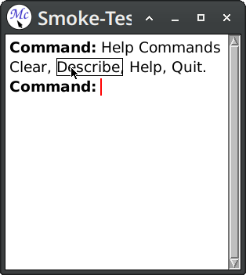

# 1 User manual

## 1.1 Running McCLIM

The McCLIM source code comes with a number of examples and applications. They are intended to showcase specific CLIM features, demonstrate programming techniques or provide useful tools. You may find them in directories `Examples` and `Apps`.


### Smoke Test

To run a minimal McCLIM application frame you need to load the system mcclim, define the frame and call find-application-frame on it:

```lisp
(eval-when (:compile-toplevel :load-toplevel :execute)
  (unless (member :mcclim *features*)
    (ql:quickload "mcclim")))

(in-package "CLIM-USER")

(define-application-frame smoke-test ()
  ())

(find-application-frame 'smoke-test)
```

The opened application will greet the user with an interactor and the prompt “Command:”. To see global commands type “Help Commands”.

Figure 1.1 shows what ought to be visible on the screen.



See [Getting started](#Getting-started) for a more complete example.


### Examples

To start the examples, load the system `clim-examples` and call the function `(clim-demo:demodemo)`. The easiest way to try this is to use *Quicklisp*:

```lisp
(ql:quickload "clim-examples")
(clim-demo:demodemo)
```

This will open a window presenting a set of available examples.

### Applications

Additionally McCLIM has a few bundled applications:

#### Apps/Listener

CLIM-enabled Lisp listener.

System name is `clim-listener`. See [Listener]() for more information.

```lisp
(ql:quickload "clim-listener")
(clim-listener:run-listener)
```

This will open a graphical Lisp listener in a separate window.


